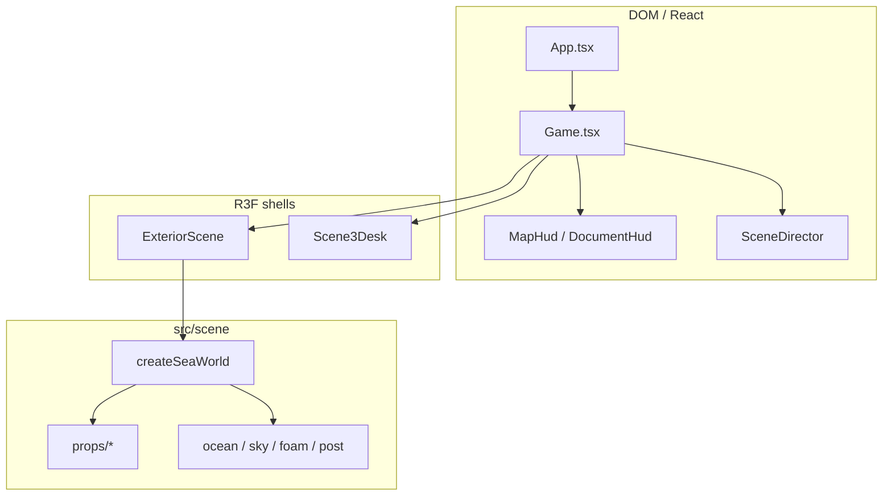

# Low-poly standards review

Dry-run audit of winzu-public against [`.cursor/skills/low_poly_web/SKILL.md`](../.cursor/skills/low_poly_web/SKILL.md) and production interactive web-3D norms.

**Verdict:** Direction is professional — discrete game FSM, DOM HUD, imperative scenic factories, plate-driven layout, palette discipline. Debt is concentrated in exterior runtime orchestration, ocean/reflection cost, incomplete lifecycle, and an unfinished asset/CI pipeline.

Paired roadmap: [`roadmap.md`](roadmap.md).

---

## Scope and method

Reviewed:

- `src/game/` — shell, director, boat, scenes, HUD, desk interaction
- `src/scene/` — props, ocean, sky, foam, lighting, post, reflect, config/layout
- `scripts/` — shot, anchors, compress-glb (budgets), compress-plates, generate-og
- Tooling — Vitest, ESLint, Prettier, GitHub Pages workflow
- Art docs — [`assets/scene_flow.md`](../assets/scene_flow.md), [`assets/palette_ref.md`](../assets/palette_ref.md)

Out of scope for this review (and intentionally not recommended):

- Photoreal water / PBR overhaul
- Full rewrite to declarative R3F mesh trees
- Replacing procedural props before a real GLB pipeline exists

---

## Scorecard

| Area              | Rating   | Notes                                                                      |
| ----------------- | -------- | -------------------------------------------------------------------------- |
| Architecture      | **Warn** | Strong layering; `ExteriorWorld` is a god orchestration blob               |
| Visual language   | **Pass** | Flat Lambert props, restrained palette, stylized silhouettes               |
| Performance       | **Fail** | Dense ocean, per-frame reflection, unmerged clouds/foam                    |
| Assets / pipeline | **Pass** | meshopt + budgets; boat/LH GLB on; plates compressed; girl/pier/desk gated |
| Animation / React | **Warn** | Motion off React state; marker arrival lacks a latch                       |
| Interaction       | **Pass** | DeskPicker pure; sail input works; cursor side-effect is small             |
| Product / CI      | **Pass** | CI gates PRs; Pages deploys after CI; live CTAs in `site.ts`               |

Ratings: **Pass** = protect and extend · **Warn** = fix before scaling · **Fail** = blocks “professional mobile/web” claims.

---

## Architecture summary

Hybrid model: React owns discrete game/UI state; the frame loop mutates Three via refs and factory handles.

| Layer         | Role                                  | Status      |
| ------------- | ------------------------------------- | ----------- |
| App           | Brand chrome + locale                 | Thin — good |
| Game          | `GameState`, scene mount, DOM HUD     | Good        |
| SceneDirector | Pure intro→sail→dock→desk FSM         | Excellent   |
| SeaWorld      | One-shot scenic graph factory         | Good        |
| ExteriorScene | Cinematics, sail, post, layout, input | Too large   |
| Scene3Desk    | Desk canvas, pick, focus camera       | Acceptable  |
| props/*       | `createX` + `update` handles          | Good        |

---

## Best practices (preserve)

### 1. DOM HUD outside the Canvas

[`src/game/Game.tsx`](../src/game/Game.tsx) keeps Map/Document UI in `.game-hud`, not inside WebGL. Matches the skill split of DOM UI vs R3F.

### 2. Pure, testable scene director

[`src/game/director/SceneDirector.ts`](../src/game/director/SceneDirector.ts) is a reducer-style FSM with no Three or React imports. Covered by unit tests. Discrete beats belong in React state; frames do not.

### 3. Imperative scenic factory

[`src/game/scenes/SeaWorld.ts`](../src/game/scenes/SeaWorld.ts) builds the shared exterior graph once. Props stay as factories (`Boat`, `Rock`, `Girl`, …), not one React component per mesh.

### 4. Animation stays off React

`useFrame` mutates boat, foam, ocean uniforms, girl bob. Game `useState` advances on events (intro complete, dock, focus, ask) — correct for 60 FPS work.

### 5. Interaction logic separated from meshes

[`src/game/interaction/DeskPicker.ts`](../src/game/interaction/DeskPicker.ts) maps prop ids → HUD intents. Keep picking pure; keep meshes dumb.

### 6. Plate-driven layout

[`src/scene/config.ts`](../src/scene/config.ts) `LAYOUT` + [`src/scene/layout.ts`](../src/scene/layout.ts) / [`uvPlacement.ts`](../src/scene/math/uvPlacement.ts) place props from reference UVs. Professional scenic workflow for plate matching.

### 7. Low-poly material discipline

- `lambertFlat` / vertex-colored Lambert with `flatShading: true` ([`LightRig.ts`](../src/scene/lighting/LightRig.ts))
- Icosahedron rocks/clouds, low-segment cylinders, box deck
- Minimal textures; procedural / vertex color first
- Shadows off outdoors; soft shadow only on desk

### 8. Performance awareness already present

- Instanced marker trail ([`MarkerTrail.ts`](../src/scene/props/MarkerTrail.ts))
- Mountain bands merged per depth layer ([`Mountains.ts`](../src/scene/bg/Mountains.ts))
- DPR caps, bloom/reflection half-res ([`PERF` in `config.ts`](../src/scene/config.ts))
- Canvas AA off + FXAA in composer
- `reducedMotion` / `?scene=` skip paths ([`types.ts`](../src/game/types.ts))
- Lazy exterior/desk chunks in Game
- GLB feature flags default off with procedural fallbacks

### 9. Shared atmosphere tokens

One sun vector / intensity drives sky, ocean, and lights via [`SceneRuntime`](../src/scene/config.ts). Palette documented in [`assets/palette_ref.md`](../assets/palette_ref.md).

### 10. Content spine

Typed EN/ES catalogs, citation-validating ask graph ([`barNorte.ts`](../src/data/barNorte.ts), [`ask.ts`](../src/data/ask.ts)), a11y roles on document HUD — stronger than a typical demo.

---

## Anti-patterns (fix)

Severity: **P0** ship-blocking cost or correctness · **P1** architecture / draw debt · **P2** pipeline / hygiene · **P3** polish / optional.

### P0 — Marker arrival without a latch

**Where:** [`ExteriorScene.tsx`](../src/game/scenes/ExteriorScene.tsx) sail `useFrame` calls `onReachMarker(markersReached)` every frame while inside radius.

**Why bad:** Intro/dock use `introDone` / `dockDone` refs; markers do not. Director ignores duplicate indexes, but React still gets redundant `setState` work until commit.

**Fix direction:** Latch with a ref (same pattern as intro/dock).

### P0 — Ocean density vs facet look

**Where:** [`config.ts`](../src/scene/config.ts) `OCEAN.segments: 180`; [`OceanMaterial.ts`](../src/scene/ocean/OceanMaterial.ts) `toNonIndexed()` + `frustumCulled = false`.

**Why bad:** Facet look is largely shader lattice normals. Dense non-indexed plane is vertex/fill cost without low-poly honesty. Conflicts with skill “avoid unnecessarily dense geometry.”

**Fix direction:** Drop to ~48–80 segments (or camera-local amp); reconsider non-indexed if lattice already sells facets.

### P0 — Reflection pass for ~5% mix

**Where:** [`ExteriorScene.tsx`](../src/game/scenes/ExteriorScene.tsx) renders reflection every frame; ocean mixes `reflAmt` ≈ fresnel × **0.05**.

**Why bad:** Roughly a second scene render for a subtle painterly tint. Sky fresnel alone is enough for stylized water on mobile.

**Fix direction:** Quality gate (desktop-only / every N frames / off on mobile) or remove.

### P1 — ExteriorWorld god component

**Where:** [`ExteriorScene.tsx`](../src/game/scenes/ExteriorScene.tsx) (~670 lines) owns camera cinematics, layout fit, GLB swap, composer, intro/dock/sail, click nav, and the full per-frame update.

**Why bad:** Skill: “Never put the entire scene into one component.” Construction is split (`SeaWorld`); **runtime orchestration is not**.

**Fix direction:** Modules: IntroDirector / SailController / DockDirector / ExteriorFrameLoop / ExteriorPost. Keep SeaWorld as the graph builder.

### P1 — Per-frame allocations in camera / look

**Where:** Exterior camera rig allocates `Vector3` temps each frame; desk clones look targets ([`Scene3Desk.tsx`](../src/game/scenes/Scene3Desk.tsx)).

**Why bad:** GC pressure on mobile. Contrast with pooled temps in `uvPlacement.ts`.

**Fix direction:** Module-level or ref-owned scratch vectors.

### P1 — Cloud and foam draw sprawl

**Where:** [`Clouds.ts`](../src/scene/bg/Clouds.ts) ~35 lobe meshes, `frustumCulled = false`; [`Foam.ts`](../src/scene/foam/Foam.ts) new `MeshBasicMaterial` per `foamMat()` call + many tiny meshes.

**Why bad:** Skill wants minimal draw calls and instancing for repeated objects. Materials proliferate without visual gain.

**Fix direction:** Merge lobes per bank (or InstancedMesh); share foam materials by opacity; merge waterline rings.

### P1 — Sail CPU morph every frame

**Where:** [`Boat.ts`](../src/scene/props/Boat.ts) `billowSail` rewrites positions + `computeVertexNormals()`.

**Why bad:** CPU geometry work every frame for a decorative sail. Belongs in a vertex shader (rest position + time).

### P1 — Incomplete SeaWorld dispose — **resolved (Phase 4)**

**Where:** Exterior unmount previously disposed composer + reflection only.

**Fix landed:** `disposeObject3D` + `disposeSeaWorld`; foam/boat/cloud handle dispose; Exterior cleanup calls both post + scenic dispose. Dual Canvas kept; remount cost documented in README.

### P1 — Dual always-on Canvases — **partially resolved (Phase 4)**

**Where:** Separate `Canvas` in Exterior and Desk.

**Fix landed:** Desk `frameloop="demand"` + invalidate on pointer/focus/camera blend. Exterior stays `always`. Single-Canvas refactor deferred.

### P2 — Asset pipeline — **resolved (Phase 5)**

**Where:** [`scripts/compress-glb.mjs`](../scripts/compress-glb.mjs); [`compress-plates.mjs`](../scripts/compress-plates.mjs) / [`generate-og.mjs`](../scripts/generate-og.mjs); Lambert normalize + MeshoptDecoder on load.

**Fix landed:** meshopt compress with per-asset size/tri budgets; plate compression vs OG split; boat + lighthouse `useGlb: true`; girl/pier/desk stay gated until sources exist.

### P2 — CI builds only

**Where:** [`.github/workflows/pages.yml`](../.github/workflows/pages.yml) runs `yarn build` only.

**Why bad:** Lint/test/format can fail locally and still ship if types pass.

**Fix direction:** PR workflow: `format:check` → `lint` → `test` → `build`; keep Pages deploy on green `main`.

### P2 — Ship placeholders — resolved (Phase 7)

**Was:** example CTAs; root-absolute favicon under `/winzu-public/`.  
**Now:** live CTAs in [`src/site.ts`](../src/site.ts); favicon uses `%BASE_URL%`; OG stays absolute to Pages.

### P3 — Dead or mixed intent

- Exterior `castShadow` marks with shadow maps disabled
- Desk embeds a Three graph while `MapHud` is the primary map UI (dual presentation)
- Naming: “SceneDirector” is FSM; cinematic direction lives in Exterior + timelines

---

## Skill checklist

| Skill rule                                                    | Status                                          |
| ------------------------------------------------------------- | ----------------------------------------------- |
| Low poly / faceted / stylized                                 | Pass on props; ocean denser than needed         |
| Restrained materials / minimal textures                       | Pass                                            |
| Warm directional + cool ambient                               | Pass                                            |
| Flat shading where style needs it                             | Pass (Lambert flat)                             |
| Prefer simple geos                                            | Pass on props; fail on ocean segs               |
| Subtle / procedural animation                                 | Pass                                            |
| No expensive per-frame React state                            | Warn (marker latch)                             |
| 60 / 30+ FPS targets                                          | Unproven; cost stack suggests mobile risk       |
| Minimal draws / instancing / LOD                              | Partial (markers good; clouds/foam/LOD missing) |
| Compressed GLB                                                | Pass (meshopt + budgets; boat/LH enabled)       |
| Separate DOM / React / R3F / assets / animation / interaction | Pass with Exterior caveat                       |
| Never one scene component                                     | Fail on ExteriorWorld runtime                   |

---

## What “professional” means here

For this project, professional does **not** mean photoreal or maximal shader complexity. It means:

1. **Readable architecture** — each file has one job; exterior runtime is modular.
2. **Honest low-poly cost** — facet look without dense meshes and redundant full-screen passes.
3. **Quality tiers** — desktop cinematic vs mobile budget without forking the art direction.
4. **Lifecycle hygiene** — create and dispose; no silent GPU leaks on scene swap.
5. **Real pipeline** — compress, budgets, CI gates, ship checklist.
6. **Protected product spine** — director, ask/citations, i18n stay pure and tested.

Preserve the hybrid R3F shell + imperative graph. Do not rewrite into a mega declarative scene tree.
